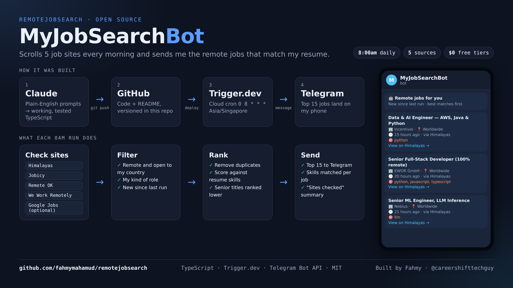

# MyJobSearchBot — remote job alerts on Telegram



[](LICENSE)


Every morning at 8:00am, this bot checks 5 job sites for **remote jobs you can apply for from your country**, keeps the roles you care about, ranks them against **your resume skills**, and sends the best matches to **Telegram**. No more scrolling job boards.

I built it for my own job search as a Singapore-based career switcher into AI and data engineering. Fork it and point it at your own country, roles and skills.

## What a message looks like

```
🤖 Remote jobs for you · Mon, 28 Sept
🆕 12 new since last run · top 12 by resume match

🌐 Sites checked
• Himalayas: 100 checked → 64 open to Singapore → 21 your roles → 9 new
• Jobicy: 100 checked → 14 open to Singapore → 3 your roles → 1 new
• ...

1. Data & AI Engineer — AWS, Java & Python
🏢 Incentivio · 📍 Worldwide
🕒 15 hours ago · 🌐 via Himalayas
🎯 python
View on Himalayas →
```
*(Counts in the "Sites checked" lines are illustrative; the job is from a real digest.)*

The **Sites checked** lines show how many jobs each site returned and where they dropped out, so a quiet day tells you why it was quiet.

## How it works

1. **Check sites.** Himalayas, Jobicy, Remote OK, We Work Remotely, plus Google Jobs if you add a SerpAPI key.
2. **Filter.** Keep jobs that are remote *and* open to your country, whose title matches your role keywords, and that were posted since the last run.
3. **Rank.** Remove duplicates across sites, score each job against your resume keywords, and push very senior titles (Head, Director, Staff, Principal) lower.
4. **Send.** Post the top 15 to your Telegram chat.

| Site | How it's read | Country check | Site's terms |
|---|---|---|---|
| [Himalayas](https://himalayas.app/api) | Search API | `country=<your country>` on the server | Credit and link back to Himalayas |
| [Jobicy](https://jobicy.com/jobs-rss-feed) | API, one region (`apac` by default) | Drops jobs locked to another country | Credit Jobicy, link to the original job; at most 1 call per hour |
| [Remote OK](https://remoteok.com/api) | JSON API | No location, or your country / Asia / worldwide | Credit and link back to Remote OK |
| [We Work Remotely](https://weworkremotely.com/remote-jobs.rss) | RSS feed | If the job lists countries, yours must be one | — |
| Google Jobs (optional) | [SerpAPI](https://serpapi.com/google-jobs-api) | Google's work-from-home flag or "remote" in the text | Free plan: 250 searches/month; the default uses about 120 |

Every job links to its original posting and names its source, as the sites ask.

## Set it up (about 15 minutes)

You need free accounts on [Trigger.dev](https://trigger.dev), [GitHub](https://github.com) and Telegram, plus Node.js 20+.

1. **Fork and clone** this repo, then run `npm install`.
2. **Create a Trigger.dev project.** Copy its project ref (`proj_...`) into `trigger.config.ts`.
3. **Create a Telegram bot.** Message [@BotFather](https://t.me/BotFather), send `/newbot`, and copy the token.
4. **Find your chat ID.** Send your new bot any message, then open `https://api.telegram.org/bot<TOKEN>/getUpdates` and copy the number after `"chat":{"id":`.
5. **Add environment variables** in Trigger.dev → Environment Variables → **Production** (see the table below).
6. **Deploy:**
   ```bash
   npx trigger.dev@4.6.4 login
   npx trigger.dev@4.6.4 deploy
   ```
7. **Test it.** In Trigger.dev, open Test → `ai-remote-job-digest` → Run. Set `LOOKBACK_HOURS` to `72` first so the test shows the last 3 days, then remove it.

From then on it runs by itself every day at 8:00am. To change the time or timezone, edit the `cron` line in `trigger/job-digest.ts`.

## Settings

Lists are separated with `|`, for example `python|sql|azure`.

| Variable | Needed? | What it does | Default |
|---|---|---|---|
| `TELEGRAM_BOT_TOKEN` | Yes | Your bot's token from @BotFather | — |
| `TELEGRAM_CHAT_ID` | Yes | Where the bot sends messages | — |
| `JOB_COUNTRY` | No | The country you live in. Jobs must be open to it | `Singapore` |
| `JOBICY_GEO` | No | Jobicy region: `apac`, `emea`, `latam`, `usa`, `canada`, `europe` … | `apac` |
| `RESUME_KEYWORDS` | No | Your skills, used to rank jobs | My skills: `python`, `sql`, `azure`, `gcp`, `snowflake`, `databricks`, `n8n`, `supabase` … |
| `ROLE_KEYWORDS` | No | Words a job title must contain | `ai`, `data engineer`, `automation`, `full stack`, `web developer` … |
| `HIMALAYAS_QUERIES` | No | Searches sent to Himalayas | `data engineer`, `ai engineer`, `machine learning`, `automation`, `full stack` |
| `SERPAPI_API_KEY` | No | Turns on Google Jobs | off |
| `JOB_QUERIES` | No | Google Jobs searches | 4 AI / data searches |
| `JOB_SOURCES` | No | Only keep Google Jobs results from these sites, e.g. `LinkedIn\|Indeed` | all sites |
| `JOB_LOCATION`, `JOB_GL` | No | Google Jobs location and country code | `JOB_COUNTRY`, `sg` |
| `MAX_RESULTS` | No | Jobs per message | `15` |
| `LOOKBACK_HOURS` | No | For testing: look back this many hours instead of "since last run" | off |

## Project layout

```
trigger/job-digest.ts   the scheduled task: fetch → filter → rank → send
trigger/lib/sources.ts  one function per job site
trigger/lib/match.ts    role filter and resume scoring
trigger.config.ts       your Trigger.dev project ref
```

## Design notes

- **"New" without a database.** Each run uses the schedule's `lastTimestamp`, so it only shows jobs posted since the previous run.
- **One broken site never stops the message.** Sites are fetched separately, and any failure is named in the message.
- **Senior roles are ranked lower, not hidden.**
- **Himalayas sends `pubDate` in seconds**, even though its docs say milliseconds. The code handles both.

## Built with

Built with [Claude](https://claude.ai) as part of the #AISChallenge: plain-English prompts in, tested TypeScript out, then GitHub → Trigger.dev → Telegram.

## License

[MIT](LICENSE). The license covers this code. Job listings belong to the sites they come from, so follow each site's terms (see the Sources table).
